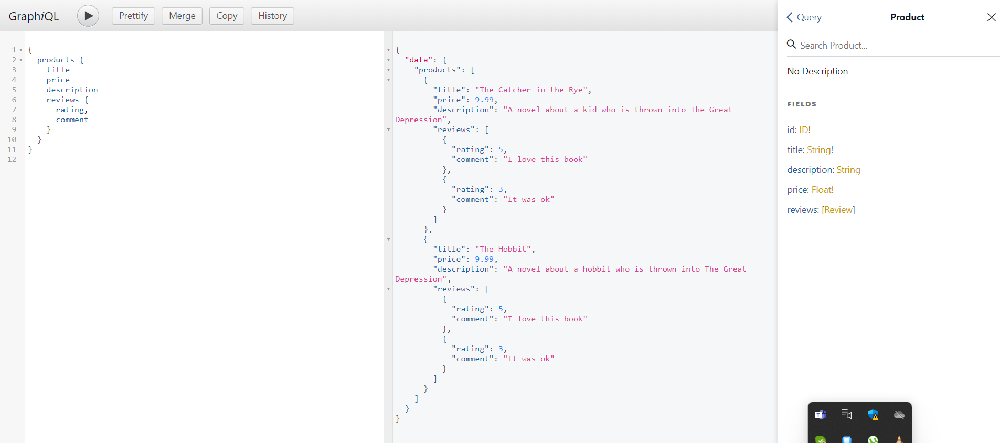

# graphql_schema_design

`npm install 

npm run start

`

# check in queries for products

{
  products {
    title
    price
    reviews {
      rating,
      comment
    }
  }
}

# screenshot 

# check in queries for orders

{
  orders{
    date,
    subtotal
    items{
      product{
        title,
        id,
        price
      }
    }
  }
}

# screenshot 

